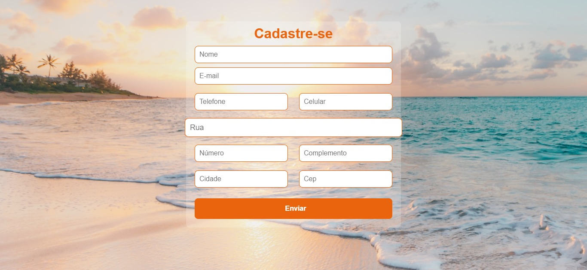
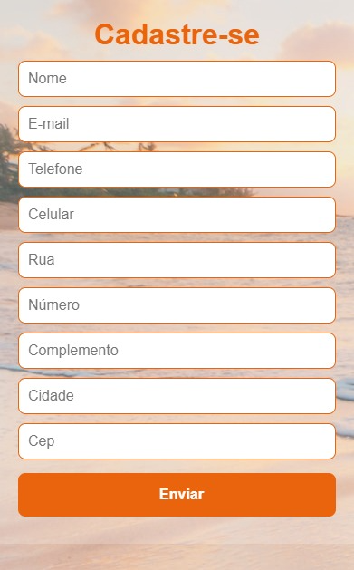

# TI360-Challenger

## Table of contents
- [TI360-Challenger](#ti360-challenger)
  - [Table of contents](#table-of-contents)
  - [Overview](#overview)
    - [The challenger](#the-challenger)
- [Screenshot](#screenshot)
    - [Desktop](#desktop)
    - [Mobile](#mobile)
    - [Links](#links)
- [Continued development:](#continued-development)
    - [Useful resources:](#useful-resources)
    - [Author:](#author)

## Overview

### The challenger

Users must be able to:

- Create a registration form
- Preview the optimal layout depending on the device screen size.

# Screenshot

 ### Desktop

### Mobile

### Links

- Solution URL: [Repo](https://github.com/Lucs25/TI360-Challenger)
- Live Site URL: [Live site](https://ti-360-challenger.vercel.app/)

# Continued development:

 

### Useful resources:

- Semantic HTML5 markup
- CSS custom properties
- Flexbox
- Mobile-first workflow

### Author:

Lucas Raymundo
